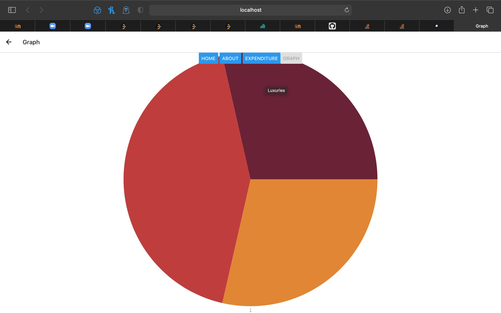

# SpendWisely

SpendWisely is an app made in React Native to track your personal finances.

## Installation

In terminal, type

```bash
cd CPA1
expo start
```

## Why use SpendWisely?

SpendWisely simplifies keeping track of your personal finances. It provides visualization tools to see how much money you are spending, and provides ways to easily enter what you are spending money on.

## Plugins
x
- @react-navigation
- react-native-gesture-handler
- @react-native-async-storage
- react-minimal-pie-chart

## License

[MIT](https://choosealicense.com/licenses/mit/)




https://user-images.githubusercontent.com/44783868/146114531-ffbea07f-dbeb-45b8-96c9-0b931d1ec5cb.mp4

